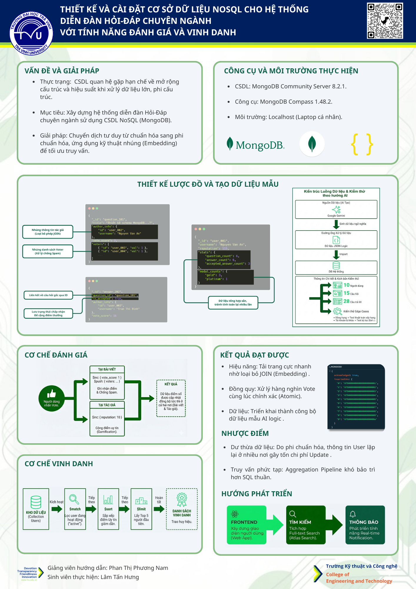

# ĐỒ ÁN CƠ SỞ NGÀNH

[](https://www.mongodb.com/)
[](https://github.com/lamhung2k5)

> **Đề tài:** Thiết kế và cài đặt cơ sở dữ liệu NoSQL cho hệ thống diễn đàn Hỏi-Đáp chuyên ngành với tính năng đánh giá và vinh danh.

---

## 1. THÔNG TIN SINH VIÊN
| Thông tin | Chi tiết |
| :--- | :--- |
| **Họ và tên** | **Lâm Tấn Hưng** |
| **MSSV** | **110123015** |
| **Lớp** | ĐH. CÔNG NGHỆ THÔNG TIN 2023 (DA23TTA) |
| **Giảng viên hướng dẫn** | ThS. Phan Thị Phương Nam |
| **Email** | lamh31387@gmail.com |

---

## 2. GIỚI THIỆU DỰ ÁN
Dự án tập trung nghiên cứu và chuyển đổi tư duy từ CSDL Quan hệ (RDBMS) sang CSDL Phi quan hệ (NoSQL). Hệ thống mô phỏng một diễn đàn chuyên ngành CNTT (tương tự StackOverflow) với các tính năng:
* **Lưu trữ hướng tài liệu (Document-oriented):** Tối ưu hóa truy vấn bằng kỹ thuật Embedding (Nhúng).
* **Hệ thống Đánh giá (Voting):** Sử dụng toán tử cập nhật nguyên tử (Atomic Updates) để xử lý đồng quy.
* **Hệ thống Vinh danh (Ranking):** Tự động tính toán xếp hạng và trao huy chương bằng Aggregation Framework.

---

## 3. CẤU TRÚC KHO LƯU TRỮ
Cấu trúc thư mục tuân thủ quy định nộp bài của Bộ môn:

```text
110123015_LamTanHung_DoAnNoSQL/
├── src/                      # Mã nguồn & Dữ liệu mẫu
│   ├── 1_init_data.mongodb   # Script tạo CSDL và nạp dữ liệu (Users, Questions, Answers)
│   ├── 2_crud_basic.mongodb  # Script demo chức năng cơ bản (Đăng, Sửa, Ẩn bài)
│   ├── 3_voting.mongodb      # Script demo chức năng Đánh giá (Vote Up/Down)
│   └── 4_ranking.mongodb     # Script demo chức năng Vinh danh & Xếp hạng
│
├── thesis/               # Hồ sơ báo cáo
│   ├── doc/              # Báo cáo bản Word
│   ├── pdf/              # Báo cáo bản PDF
│   ├── abs/              # Slide thuyết trình (.pptx)
|   ├── poster/           # Poster giới thiệu đồ án
│   └── refs/             # Tài liệu tham khảo
│
├── soft/                 # Link tải phần mềm MongoDB & Compass
└── README.md             # File hướng dẫn này
```
---

## 4. YÊU CẦU CÀI ĐẶT
Để chạy mã nguồn ổn định, vui lòng cài đặt:

* **MongoDB Community Server:** v8.2.1 ([Tải tại đây](https://www.mongodb.com/))

* **MongoDB Compass:** v1.48.2 ([Tải tại đây](https://www.mongodb.com/try/download/shell))

* **Git Bash:** Để clone project ([Tải tại đây](https://git-scm.com/install/))

## 5. HƯỚNG DẪN CHẠY DEMO (TỪNG BƯỚC)
* **Bước 1:** Tải mã nguồn
Mở Git Bash và chạy lệnh:
 ```text
git clone [https://github.com/lamhung2k5/csn-da23tta-lamtanhung-diendanhoidapchuyennganh.git](https://github.com/lamhung2k5/csn-da23tta-lamtanhung-diendanhoidapchuyennganh.git)
```
* **Bước 2:** Khởi tạo dữ liệu
1. Mở **MongoDB Compass**.
2. Kết nối vào `localhost:27017`.
3. Mở file `src/1_init_data.mongodb` bằng Notepad -> **Copy toàn bộ code**.
4. Dán vào thanh **Mongosh (Shell)** trong Compass -> Nhấn **Enter**.

*(Lưu ý: nếu thành công, màn hình sẽ báo* ```acknowledged: true```)


### Bước 3: Chạy thử nghiệm các chức năng
Thực hiện tương tự **Bước 2** với các file còn lại:

* **File 2 (CRUD):** Kiểm tra việc đăng bài mới và admin ẩn bài vi phạm.
* **File 3 (Voting):** Kiểm tra logic cộng điểm uy tín cho tác giả khi có người vote.
* **File 4 (Ranking):** Xem danh sách Top 5 User và Bảng xếp hạng huy chương.


---

## 6. POSTER ĐỒ ÁN
Dưới đây là Poster tóm tắt kết quả nghiên cứu:



*(Nếu ảnh không hiển thị rõ, bạn có thể [xem file gốc tại đây](https://github.com/lamhung2k5/csn-da23tta-lamtanhung-diendanhoidapchuyennganh/blob/main/thesis/poster/posterCSN.png))*
---

## 7. LIÊN HỆ
Mọi thắc mắc về mã nguồn xin vui lòng liên hệ:

* **Email:** [lamhung2k5@gmail.com](mailto:lamh31387@gmail.com)
* **GitHub:** [lamhung2k5](https://github.com/lamhung2k5)

*Cảm ơn Quý Thầy/Cô và các bạn đã quan tâm!*
